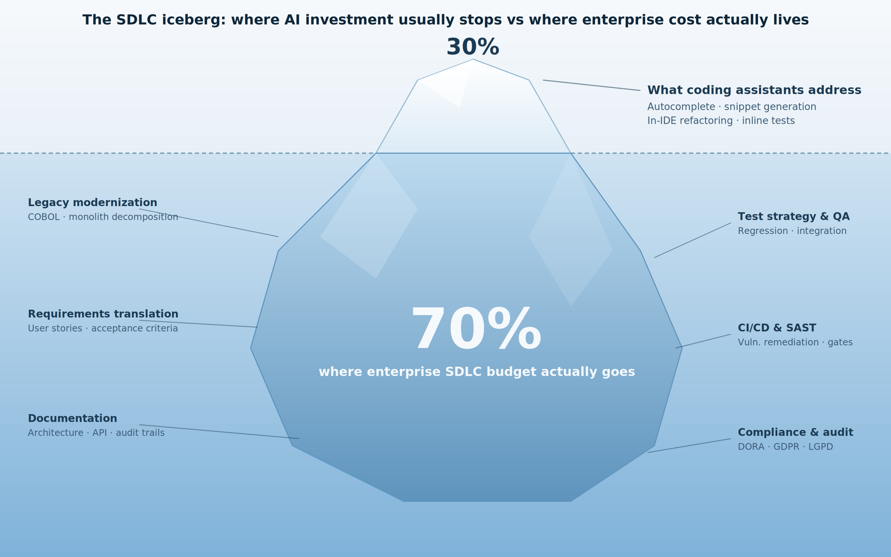
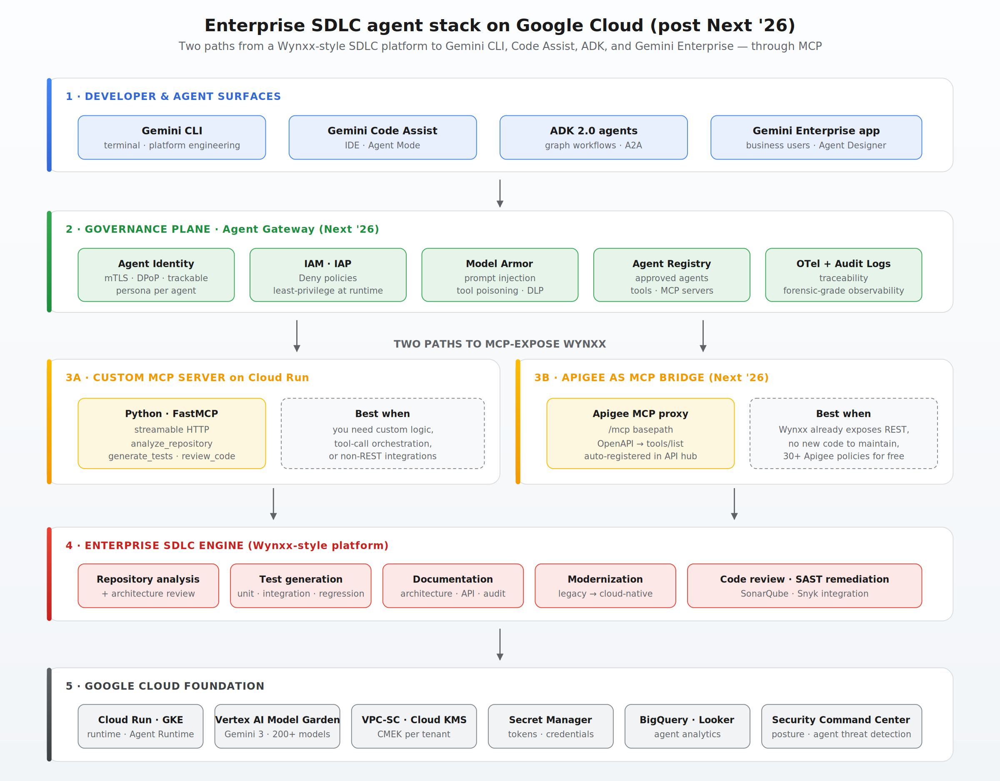

# After Next '26: A Reference Architecture for Enterprise SDLC Agents on Google Cloud

*How to expose an enterprise SDLC platform as MCP, govern it through Agent Gateway, and consume it from Gemini CLI, Gemini Code Assist, ADK, and Gemini Enterprise — without building yet another silo.*

---

## TL;DR

At Cloud Next '26, Thomas Kurian declared the end of the AI pilot era. Sundar Pichai noted that the enterprise question shifted from *"can we build an agent?"* to *"how do we manage thousands of them?"* Google's answer was a consolidation: Vertex AI rebranded as the **Gemini Enterprise Agent Platform**, **ADK 2.0** with a graph-based workflow runtime, **50+ Google-managed MCP servers**, **Apigee as an MCP bridge**, **Agent Gateway**, **Agent Identity**, **Agent Registry**, and **Model Armor**.

For enterprises with their own SDLC platforms — testing engines, modernization frameworks, internal developer portals — this changes the integration story completely. You no longer have to choose between building an isolated coding assistant or wiring everything by hand.

In this article, you'll find:

- Why coding assistants stop at 30% of the SDLC and what the other 70% requires
- A reference architecture for the post-Next '26 enterprise agent stack on Google Cloud
- **Two practical paths** to expose an enterprise SDLC platform (Wynxx-style) as MCP: a custom server on Cloud Run, or Apigee as an MCP bridge — with full code
- How **Agent Gateway**, **Agent Identity**, and **Model Armor** govern the integration end-to-end
- An **ADK 2.0 graph-based workflow** that orchestrates the same tools across multiple agents
- A 90-day phased adoption roadmap that survives the trip from prototype to operating model

The full code is intentionally minimal so the architectural decisions stay visible.

---

## The 30% problem (and the 70% nobody is solving)

In most enterprise AI conversations, the first question is about the model. *Which one? How large? How accurate?*

In large engineering organizations, those are rarely the hardest questions. The harder one is this:

> How do we bring AI into the real software delivery lifecycle without creating another isolated assistant?

Leading a Google Cloud practice that delivers AI solutions into regulated environments, I see the same pattern repeat across clients. Developers adopt a coding assistant. Platform teams write their own pipeline scripts. Architects experiment with modernization prompts. QA builds a parallel test-generation flow. Modernization squads keep a backlog of legacy systems waiting for assessment. Leadership wants productivity metrics. Security wants traceability. Governance wants control.

Everyone is moving. Not always in the same direction. The outcome is not a lack of AI — it is **fragmentation**.

It helps to picture the SDLC as an iceberg.



Coding assistants address roughly 30% of the SDLC — the part everyone can see: autocomplete, snippet generation, in-IDE refactoring. The other 70% — legacy modernization, requirements translation, test strategy, documentation, CI/CD governance, compliance — is where the real enterprise budget goes. It is also where AI investment hasn't landed at scale.

This is the gap that platforms like **Wynxx** (GFT's GenAI platform for enterprise software delivery) are built to close. Wynxx is model-agnostic, supports Gemini natively, and is designed for the 70%. But to land a Wynxx-style platform inside a Google Cloud customer's AI stack without adding yet another silo, it should not be presented as a competing assistant. It should be exposed as an **enterprise SDLC automation layer** that the developer's existing tools can call.

After Next '26, the bridge between those worlds is no longer just **Model Context Protocol (MCP)** — it is MCP **plus the new governance plane Google announced around it.**

---

## What changed at Next '26 (the parts that matter for SDLC agents)

A lot was announced. The pieces that change the integration story for SDLC platforms are:

- **Gemini Enterprise Agent Platform** — Vertex AI's agent tooling, Agentspace, ADK, observability, and registry collapsed into one surface organized around *build, scale, govern, optimize*.
- **ADK 2.0** — graph-based workflow runtime with deterministic routing, fan-out/fan-in, retry, state management, human-in-the-loop, and nested workflows. Stable across Python, Go, Java, TypeScript.
- **50+ Google-managed MCP servers** — GA or preview across BigQuery, Spanner, AlloyDB, Cloud SQL, Firestore, Bigtable, Cloud Run, GKE, Maps, Security Operations, and more. No local MCP server to operate.
- **MCP support in Apigee** — turn any existing API into a discoverable, governed MCP tool through an MCP proxy, with no code changes. Automatically registered in Apigee API hub.
- **Agent Gateway** — central enforcement point for agent-to-tool and agent-to-agent traffic, in both ingress and egress modes. Inspects MCP and A2A protocol traffic.
- **Agent Identity** (GA) — mTLS-secured trackable persona for every agent, with end-to-end cryptographic authentication via DPoP.
- **Agent Registry** — central library of approved agents, tools, and third-party MCP servers.
- **Model Armor** — runtime guardrails against prompt injection, tool poisoning, indirect prompt injection, and data leakage. Integrates with Agent Gateway, Agent Runtime, ADK, and LangChain.
- **A2A protocol v1.0** — agent-to-agent standard, in production at 150+ organizations, governed by the Linux Foundation, integrated with LangGraph, CrewAI, LlamaIndex, AutoGen, and Semantic Kernel.
- **Gemini 3 family** — Gemini 3 Pro and Gemini 3 Flash are now the default reasoning backbone. Gemini 2.5 is being retired in October 2026.

For an enterprise that already has an SDLC platform like Wynxx, this means three things:

1. You can expose your platform without writing a custom MCP server (Apigee path) **or** write one in any language (Cloud Run path).
2. Every consumer surface — Gemini CLI, Gemini Code Assist, ADK agents, Gemini Enterprise app — can discover your tools through the same registry.
3. The governance plane is no longer something you assemble. It is a product.

---

## The reference architecture



Five layers, top to bottom:

**Layer 1 — Developer & agent surfaces.** Gemini CLI for terminal-driven work (platform engineering, modernization). Gemini Code Assist for in-IDE development with Agent Mode. ADK 2.0 agents for orchestrated multi-step workflows. Gemini Enterprise app for business users who need to consume the same capabilities through a guided experience.

**Layer 2 — Governance plane.** Agent Gateway sits between every surface and every tool. It validates **Agent Identity** (mTLS persona) against **IAM** policies, runs **Model Armor** to neutralize prompt injection and tool poisoning, looks up approved tools in **Agent Registry**, and emits **OpenTelemetry traces and Cloud Audit Logs**. This layer is what's new after Next '26.

**Layer 3 — MCP exposure of the SDLC platform.** Two paths, covered in detail below: a custom MCP server on Cloud Run, or Apigee as an MCP bridge over the platform's existing APIs.

**Layer 4 — Enterprise SDLC engine.** The Wynxx-style platform: repository analysis, test generation, documentation, modernization, code review, SAST remediation.

**Layer 5 — Google Cloud foundation.** Runtime (Cloud Run, GKE, Agent Runtime), models (Vertex AI Model Garden with Gemini 3 plus 200+ models including Claude, Llama, Gemma), security (VPC-SC, Cloud KMS, Secret Manager, SCC), and analytics (BigQuery, Looker).

The interesting design decisions live in Layers 2 and 3. The rest is plumbing.

---

## Designing the MCP contract

Before either path, decide what the contract looks like. A common failure mode in enterprise MCP is tool sprawl: the temptation to expose every capability at once. Google Cloud's own MCP guidance addresses this with **toolsets** — subsets of tools exposed under their own endpoint, scoped to a specific workflow.

For a first enterprise rollout of a Wynxx-style platform, I would expose five tools, split across two toolsets:

```text
read-only toolset:
  analyze_repository
  explain_code
  generate_documentation_draft

advisory toolset:
  modernization_assessment
  generate_tests
  review_code
```

Each tool needs a clear purpose, a small input schema, predictable structured output, explicit safety behavior, no hidden destructive action, and traceable execution metadata. In enterprise environments, the contract is a governance artifact, not just a technical one.

Two examples:

```text
Tool: analyze_repository
Purpose: Analyze a repository and return a structured SDLC assessment.
Input:   repository_path, language, depth
Output:  summary, findings, recommended_actions, risks, artifacts

Tool: generate_tests
Purpose: Draft or recommend unit and integration tests.
Input:   repository_path, language, test_framework, coverage_target
Output:  generated_files, recommendations, warnings, status
```

Once the contracts exist, the question becomes how to expose them. Two paths.

---

## Path A — Custom MCP server on Cloud Run

This is the right path when you need custom logic, tool-call orchestration that doesn't map cleanly to REST, or integrations that aren't HTTP-based (queues, gRPC, internal protocols).

A minimal Python implementation. In a real deployment, each tool would call the Wynxx backend, enforce tenant-level authorization, emit audit logs, and return artifact references.

```python
# server.py
from typing import Optional
from mcp.server.fastmcp import FastMCP

mcp = FastMCP("wynxx", json_response=True)


@mcp.tool()
def analyze_repository(
    repository_path: str,
    language: Optional[str] = "java",
    depth: Optional[str] = "standard",
) -> dict:
    """Analyze a repository and return an enterprise SDLC assessment."""
    # Real implementation: call the Wynxx backend, enforce RBAC,
    # emit audit logs, and return structured artifacts.
    return {
        "repository_path": repository_path,
        "language": language,
        "depth": depth,
        "summary": "Repository analyzed successfully.",
        "findings": [
            "Spring Boot application detected",
            "Unit test coverage appears incomplete",
            "Candidate for containerization",
            "Suggested target: GKE or Cloud Run",
        ],
        "recommended_actions": [
            "Generate missing unit tests",
            "Produce architecture documentation",
            "Run a modernization assessment",
            "Define deployment strategy for Google Cloud",
        ],
    }


@mcp.tool()
def generate_tests(
    repository_path: str,
    test_framework: Optional[str] = "junit",
    coverage_target: Optional[int] = 80,
) -> dict:
    """Generate test recommendations or draft test files."""
    return {
        "repository_path": repository_path,
        "test_framework": test_framework,
        "coverage_target": coverage_target,
        "generated_artifacts": [
            "UserServiceTest.java",
            "OrderControllerTest.java",
        ],
        "warnings": [
            "Generated tests must be reviewed before commit",
            "Mocks should align with enterprise testing standards",
        ],
        "status": "draft_generated",
    }


if __name__ == "__main__":
    mcp.run(transport="streamable-http")
```

Deploy to Cloud Run with authentication enforced:

```bash
gcloud run deploy wynxx-mcp-server \
  --source . \
  --region us-central1 \
  --no-allow-unauthenticated \
  --service-account wynxx-mcp@${PROJECT_ID}.iam.gserviceaccount.com
```

The `--no-allow-unauthenticated` is not optional. For demos, teams sometimes expose Cloud Run services publicly. In an enterprise environment, that should never be the default — Agent Gateway will reach the service over an authenticated channel.

---

## Path B — Apigee as MCP bridge (the post-Next '26 path)

If your SDLC platform already exposes REST APIs — and most do — Path B may be the better answer. Since Next '26, Apigee can publish your existing APIs as MCP tools through an **MCP proxy**, with no code changes and no MCP server to operate.

The mechanics, from Google's documentation: create an MCP proxy in an environment group, specify `/mcp` as the basepath, point the target URL to `mcp.apigee.internal`, attach your OpenAPI specification, and deploy. Apigee uses the operations documented in your OpenAPI spec as the MCP tools list. The proxy is automatically registered in Apigee API hub.

A minimal OpenAPI fragment for the Wynxx tools:

```yaml
# wynxx-openapi.yaml
openapi: 3.1.0
info:
  title: Wynxx SDLC API
  version: 1.0.0
paths:
  /analyze:
    post:
      operationId: analyze_repository
      summary: Analyze a repository and return an enterprise SDLC assessment.
      requestBody:
        required: true
        content:
          application/json:
            schema:
              type: object
              properties:
                repository_path: { type: string }
                language: { type: string, default: java }
                depth: { type: string, default: standard }
              required: [repository_path]
      responses:
        '200':
          description: Structured SDLC assessment
  /generate-tests:
    post:
      operationId: generate_tests
      summary: Draft or recommend unit and integration tests.
      requestBody:
        required: true
        content:
          application/json:
            schema:
              type: object
              properties:
                repository_path: { type: string }
                test_framework: { type: string, default: junit }
                coverage_target: { type: integer, default: 80 }
              required: [repository_path]
      responses:
        '200':
          description: Generated artifacts and warnings
```

Deploy via the Apigee CLI / Console. Once the MCP proxy is live, any compliant MCP client — Gemini CLI, Code Assist, ADK, Claude, ChatGPT, VS Code — can call `tools/list` against the endpoint and discover the tools, with Apigee handling transcoding and protocol mediation.

What you get for free with Path B:

- **30+ Apigee policies** for authentication, authorization, rate limiting, quotas, and data loss prevention.
- **OAuth 2.1 / OIDC** support out of the box.
- **Apigee API hub** as a central tool catalog with semantic search.
- **Cloud DLP** integration for classifying and protecting sensitive data passing through the tool.
- **Model Armor** integration to defend against prompt injection and jailbreaking.
- **Apigee Analytics** to monitor MCP tool usage by client.

The decision between Path A and Path B isn't dogmatic. Many enterprise deployments use both: Apigee for stable, well-defined APIs already in production; a custom Cloud Run MCP server for orchestrated workflows that need internal reasoning before returning. The two coexist behind the same Agent Gateway.

---

## Wrapping it with Agent Gateway

Either path lands behind Agent Gateway, which is the part of the stack that didn't exist before Next '26 and that matters most for regulated industries.

Agent Gateway operates in two modes:

- **Client-to-Agent (ingress)** — securing traffic from a user or another agent into an agent running on Google Cloud.
- **Agent-to-Anywhere (egress)** — securing traffic from agents on Google Cloud out to MCP servers, agents, tools, or APIs running anywhere, including third-party MCP servers and your own custom ones.

For the SDLC scenario, both modes apply: ingress when developers and ADK agents call into your Wynxx MCP tools; egress when your ADK agents call out to external services.

The governance pipeline the Gateway applies, in order:

1. **Agent Identity** — validate the mTLS-secured persona of the calling agent.
2. **IAM Deny policies + IAP** — enforce least-privilege at runtime against the registered resource path in Agent Registry.
3. **Model Armor** — inspect the request and response for prompt injection, tool poisoning, sensitive data exfiltration.
4. **Audit + tracing** — emit Cloud Audit Logs and OpenTelemetry spans for the full call chain.

A simplified registration flow for a Wynxx tool:

```bash
# Register the MCP server in Agent Registry
gcloud agent-platform registry mcp-servers create wynxx-sdlc \
  --location=us-central1 \
  --endpoint-url=https://wynxx-mcp-server-xxxxx.run.app/mcp \
  --description="Enterprise SDLC automation tools"

# Grant a specific agent identity egress permission to call it
./scripts/grant_agent_mcp_egress.sh \
  --mcp wynxx-sdlc \
  --agent-id sdlc-orchestrator-agent
```

That second command is the one that matters. In a regulated environment, the explicit grant from a named agent identity to a named MCP server — recorded, auditable, revocable — is what makes the system survive a CISO review.

---

## The three consumer surfaces

The same Wynxx MCP exposure can now be reached from four places. The first three are user-facing; the fourth (Gemini Enterprise) is the front door for business users.

### 1. Gemini CLI — terminal entry point

Configure in `~/.gemini/settings.json`:

```json
{
  "mcpServers": {
    "wynxx": {
      "httpUrl": "https://wynxx-mcp-server-xxxxx.run.app/mcp",
      "authProviderType": "google_credentials",
      "oauth": {
        "scopes": ["https://www.googleapis.com/auth/cloud-platform"]
      },
      "timeout": 300000,
      "includeTools": [
        "analyze_repository",
        "generate_tests",
        "generate_documentation"
      ]
    }
  }
}
```

The `authProviderType: "google_credentials"` is the post-Next '26 default — Gemini CLI authenticates using Application Default Credentials, so there's no static bearer token to rotate. A developer in the repository runs:

```text
> Use Wynxx to analyze this repository and propose a modernization
  path to Google Cloud.
```

Gemini CLI discovers the tools, calls `wynxx.analyze_repository`, and returns structured findings. The terminal becomes a controlled interface to enterprise SDLC capabilities.

### 2. Gemini Code Assist — IDE entry point

The same `mcpServers` block lives in the Code Assist configuration. With Agent Mode enabled in the IDE, the developer's intent ("review this service, identify missing tests, generate API docs") is routed to the Wynxx tools, with human approval required for any action that writes files.

I would keep `trust: false` for the first enterprise rollout. When tools can inspect code, generate files, or interact with external systems, developers should approve invocations. In regulated environments, human approval is not friction — it is part of responsible automation.

### 3. ADK 2.0 — agentic orchestration with graph workflows

This is the surface that gets the most upgrade from Next '26. ADK 2.0 introduces a **graph-based workflow runtime** with deterministic routing, fan-out/fan-in, retries, state management, and human-in-the-loop nodes. For SDLC scenarios, this is exactly the primitive we needed — most enterprise SDLC flows are deterministic graphs, not free-form agent loops.

A simplified SDLC workflow consuming the Wynxx MCP server, using ADK 2.0:

```python
# sdlc_workflow.py
from google.adk import Agent
from google.adk.tools.mcp_tool.mcp_toolset import McpToolset
from google.adk.tools.mcp_tool.mcp_session_manager import (
    StreamableHTTPConnectionParams,
)
from google.adk.workflows import Workflow, node

# Shared toolset — every agent in the graph calls the same Wynxx MCP server
wynxx_tools = McpToolset(
    connection_params=StreamableHTTPConnectionParams(
        url="https://wynxx-mcp-server-xxxxx.run.app/mcp",
    ),
)

analyst = Agent(
    name="repo_analyst",
    model="gemini-3-pro",
    instruction="Analyze the repository and return structured findings.",
    tools=[wynxx_tools],
)

doc_writer = Agent(
    name="doc_writer",
    model="gemini-3-flash",
    instruction="Draft architecture and API documentation based on the analysis.",
    tools=[wynxx_tools],
)

test_strategist = Agent(
    name="test_strategist",
    model="gemini-3-flash",
    instruction="Recommend or draft tests, respecting the coverage target.",
    tools=[wynxx_tools],
)

modernization_advisor = Agent(
    name="modernization_advisor",
    model="gemini-3-pro",
    instruction="Produce a modernization assessment with risks and target architecture.",
    tools=[wynxx_tools],
)


@node(start=True)
def analyze(state):
    findings = analyst.run(state["repository_path"])
    return {"findings": findings}


@node(after=analyze, fan_out=["document", "test", "modernize"])
def fan_out(state):
    return state


@node()
def document(state):
    state["docs"] = doc_writer.run(state["findings"])
    return state


@node()
def test(state):
    state["tests"] = test_strategist.run(state["findings"])
    return state


@node()
def modernize(state):
    state["modernization"] = modernization_advisor.run(state["findings"])
    return state


@node(after=["document", "test", "modernize"], human_in_the_loop=True)
def review_and_publish(state):
    # Human approval gate before any artifact is written
    return state


sdlc_workflow = Workflow(
    name="sdlc_orchestration",
    nodes=[analyze, fan_out, document, test, modernize, review_and_publish],
)
```

Two design choices worth highlighting:

- **Different models for different roles.** Gemini 3 Pro for reasoning-heavy nodes (analysis, modernization). Gemini 3 Flash for high-volume, lower-latency nodes (drafting docs and tests). ADK is model-agnostic, so swapping is a one-line change.
- **Human-in-the-loop as a graph primitive.** ADK 2.0 makes `human_in_the_loop=True` a node attribute. In regulated environments, the approval gate is part of the graph, not a wrapper around it.

Deploy to Agent Runtime:

```bash
adk deploy agent_engine \
  --project=$PROJECT_ID \
  --region=us-central1 \
  --agent_path=./sdlc_workflow \
  --runtime=python3.12
```

Sub-second cold starts. OpenTelemetry tracing wired up automatically. Egress traffic routed through Agent Gateway.

### 4. Gemini Enterprise app — the business surface

The same tools, registered in Agent Registry, are also discoverable from the Gemini Enterprise app via Agent Designer. A delivery lead who isn't a developer can ask: *"Run an SDLC assessment on the payments-service repository and share the modernization summary with the CTO."* Behind the scenes, the same `sdlc_orchestration` workflow runs, governed by the same Agent Gateway, audited the same way.

This is the part most teams underestimate. Once the SDLC tools are exposed as MCP and registered, the cost of giving non-developers access to them through the Gemini Enterprise app is near zero. The hard work was the contract, the governance, and the registry.

---

## An end-to-end enterprise workflow

Picture a team modernizing a portfolio of Java applications. A developer opens a repository in VS Code and asks Gemini Code Assist:

> Use Wynxx to analyze this repository, identify missing tests, generate an architecture summary, and recommend a modernization path for Google Cloud.

What happens:

1. Gemini Code Assist reads the local workspace context.
2. Agent Mode discovers the Wynxx MCP tools via Agent Registry.
3. The developer approves the tool call.
4. Agent Gateway validates the developer's identity, the agent's identity, IAM permissions, and runs Model Armor on the request.
5. Wynxx runs repository analysis and returns structured findings.
6. The same findings are fanned out to three parallel ADK 2.0 nodes: documentation, tests, modernization.
7. Each artifact is reviewed at the human-in-the-loop gate.
8. Approved artifacts are written. Execution metadata flows to Cloud Logging, OpenTelemetry, and BigQuery.
9. Engineering leaders see productivity and modernization metrics in Looker.

The output isn't just code. It is an **SDLC package**:

```text
README.md
architecture-summary.md
api-overview.md
test-recommendations.md
modernization-assessment.md
migration-plan-gcp.md
execution-metadata.json
```

That is the difference between a coding assistant and an SDLC agent stack: the developer gets acceleration, the architect gets consistency, QA gets test recommendations, the platform team gets migration signals, security gets auditability, and the executive team gets metrics.

---

## Security and governance: the post-Next '26 baseline

MCP makes integration easier. Easier integration means governance has to be **stronger**, not lighter. An MCP server can expose tools that read code, generate files, call APIs, and interact with enterprise systems. After Next '26, the controls are no longer DIY — they are products in the platform.

| Concern | Pre-Next '26 (DIY) | Post-Next '26 (platform) |
|---|---|---|
| Agent authentication | Static bearer tokens, service accounts | **Agent Identity** with mTLS + DPoP |
| Tool authorization | App-level RBAC, custom middleware | **Agent Gateway** + **IAM Deny policies** + **IAP** |
| Prompt injection / tool poisoning | DIY input filtering | **Model Armor** at runtime |
| Sensitive data in tool calls | App-level redaction | **Cloud DLP** integrated with Apigee / Gateway |
| Tool discovery | Hand-maintained registries | **Agent Registry** + **Apigee API hub** |
| Tool execution audit | Custom logging | **Cloud Audit Logs** + **OpenTelemetry** spans |
| Agent threat detection | Manual SOC rules | **Security Command Center** with agent threat detection |

Two principles I would not skip on day one:

**Classify your tools.** Not every tool deserves the same approval workflow:

```text
Read-only:        analyze_repository, explain_code, generate_documentation_draft
Advisory:         modernization_assessment, migration_plan, architecture_review
Action-oriented:  generate_tests, update_files, create_jira_stories, commit_pr
```

Read-only tools may be easier to approve. Advisory tools influence engineering decisions. Action-oriented tools change artifacts or external systems. Different policies in Agent Gateway, different default approval modes in Code Assist.

**Treat external content as adversarial.** Google's own MCP guidance is explicit: *"be cautious with untrusted inputs."* An MCP client processing emails, documents, or repository content from unverified sources can be hijacked by hidden instructions. With Model Armor in front of every tool call, you have a defense — but the application layer also needs to assume the worst about external content.

---

## Observability: turning agent usage into engineering intelligence

The biggest mistake in AI developer tooling is measuring only local productivity. Enterprise leaders need more than anecdotes:

- How many repositories were analyzed?
- How many tests were generated?
- Which applications are modernization candidates?
- Which teams are adopting the platform?
- Where are the bottlenecks?
- What risks repeat across the portfolio?

Post-Next '26, this telemetry comes mostly for free. ADK emits OpenTelemetry traces by default. Agent Gateway adds structured Cloud Audit Logs for every tool call. The **BigQuery Agent Analytics plugin** logs detailed interactions from ADK and LangGraph directly to BigQuery for audit, troubleshooting, and long-term optimization.

A minimal execution record:

```json
{
  "execution_id": "exec-12345",
  "agent_identity": "sdlc-orchestrator-agent",
  "user_id": "user@example.com",
  "tenant_id": "banking-client-a",
  "repository": "payments-service",
  "tool": "wynxx.analyze_repository",
  "mcp_server": "wynxx-sdlc",
  "status": "success",
  "duration_ms": 12840,
  "model_armor_verdict": "allow",
  "artifacts": ["architecture-summary.md", "modernization-assessment.md"],
  "trace_id": "00-a1b2c3d4...",
  "timestamp": "2026-05-19T10:30:00Z"
}
```

Stream that to BigQuery, visualize it in Looker, and the conversation changes. Instead of *"developers are using AI,"* leadership can see:

```text
42 repositories analyzed
318 test files drafted
96 documentation artifacts generated
17 applications identified as modernization candidates
12 high-risk dependency patterns detected
2 Model Armor blocks on suspicious prompt patterns
```

That is how AI developer tooling stops being a productivity story and becomes an **engineering intelligence platform**.

---

## A 90-day phased adoption roadmap

Enterprise AI adoption usually fails when the first proof of concept cannot evolve into an operating model. A local demo is not enough. A phased path that survives the trip:

**Days 1–30 — Contract and expose**
- Define the read-only toolset (3–5 tools).
- Decide Path A (Cloud Run MCP server) or Path B (Apigee MCP proxy). For most teams with an existing REST API, start with Path B.
- Register the MCP server in Agent Registry.
- Connect Gemini CLI locally; demonstrate the read-only flow.

**Days 31–60 — Govern and observe**
- Wire Agent Gateway with Agent Identity and IAM Deny policies.
- Enable Model Armor for the toolset.
- Stream Audit Logs to BigQuery; build a first Looker dashboard.
- Add the advisory toolset behind explicit approval.

**Days 61–90 — Orchestrate and scale**
- Build a first ADK 2.0 graph workflow with fan-out/fan-in over the toolset.
- Add human-in-the-loop nodes for action-oriented tools.
- Deploy to Agent Runtime with OpenTelemetry tracing.
- Publish the workflow to the Gemini Enterprise app for business users.

Phase 4, beyond day 90: federation. Multiple SDLC agents, each specialized (documentation, modernization, test strategy, architecture review), communicating via **A2A v1.0**, all governed by the same Agent Gateway. This is the architecture that scales from one squad to thousands.

---

## Six design principles I would not skip

1. **Start with read-only tools.** Don't give agents write access to code or pipelines on day one. Start with analysis, documentation drafts, recommendations.
2. **Keep humans in control.** In ADK 2.0, `human_in_the_loop` is a node attribute. Use it for every action-oriented tool until you have a track record.
3. **Make outputs structured.** Agents reason better over predictable JSON than over long unstructured text.
4. **Log every execution.** If a tool influences engineering decisions, it should be auditable. Cloud Audit Logs + OpenTelemetry traces + BigQuery, by default.
5. **Separate local context from enterprise context.** Not every task requires sending the full repository to a remote service. Support multiple modes: metadata-only, selected files, full repository package — and never silently change between them.
6. **Design for an operating model, not a demo.** The difference between a prototype and an enterprise platform is not the prompt. It is identity, governance, security, observability, and lifecycle management — and after Next '26, most of those are products you configure, not code you write.

---

## Closing thought

The future of enterprise software delivery will not be defined by isolated coding assistants. It will be defined by **composable agentic workflows** in which IDEs, terminals, agents, business surfaces, and enterprise SDLC platforms collaborate through open protocols on a governed foundation.

After Cloud Next '26, that foundation has a name and a shape:

- **MCP** is the protocol for agent-to-tool integration.
- **A2A** is the protocol for agent-to-agent collaboration.
- **Gemini Enterprise Agent Platform** is the unified runtime, governance, and observability surface.
- **Agent Gateway, Agent Identity, Agent Registry, Model Armor** are the controls.
- **ADK 2.0** is the open-source framework for building the agents that orchestrate it all.
- **Apigee MCP proxies** turn the APIs you already have into governed tools without new code.

An enterprise SDLC platform like **Wynxx** lands inside this stack as a capability provider, not a competing assistant. The developer gets acceleration. The architect gets consistency. Security gets auditability. The executive team gets metrics. The platform team gets to stop reinventing the integration plumbing every quarter.

The opportunity is not to replace the developer. The opportunity is to remove repetitive SDLC friction while increasing consistency, governance, and visibility — at the scale Kurian was pointing at when he said the pilot era is over.

Not another assistant. A governed enterprise automation layer for the software delivery lifecycle.

---

### What's next

Three concrete starting points:

1. **Pick a path and ship a read-only toolset.** If your SDLC platform already exposes REST, do Path B with Apigee MCP. If not, build the Python FastMCP server above and deploy to Cloud Run with `--no-allow-unauthenticated`.
2. **Register in Agent Registry and connect from Gemini CLI.** This is your single-developer demo loop. Iterate on the contract here before adding any other surface.
3. **Wrap an ADK 2.0 workflow around it with one human-in-the-loop node.** That is the smallest unit that proves the architecture end-to-end and gives you something to show your CISO.

From there, the operating model is a conversation worth having with your security, platform, and engineering leadership — together.

---

*Djalma is Head of Google Cloud Practice at GFT Technologies, leading delivery of GenAI and cloud solutions for regulated financial services. Google Cloud Partner All-Star 2024, Distinguished Engineer 2025. Views are his own.*
